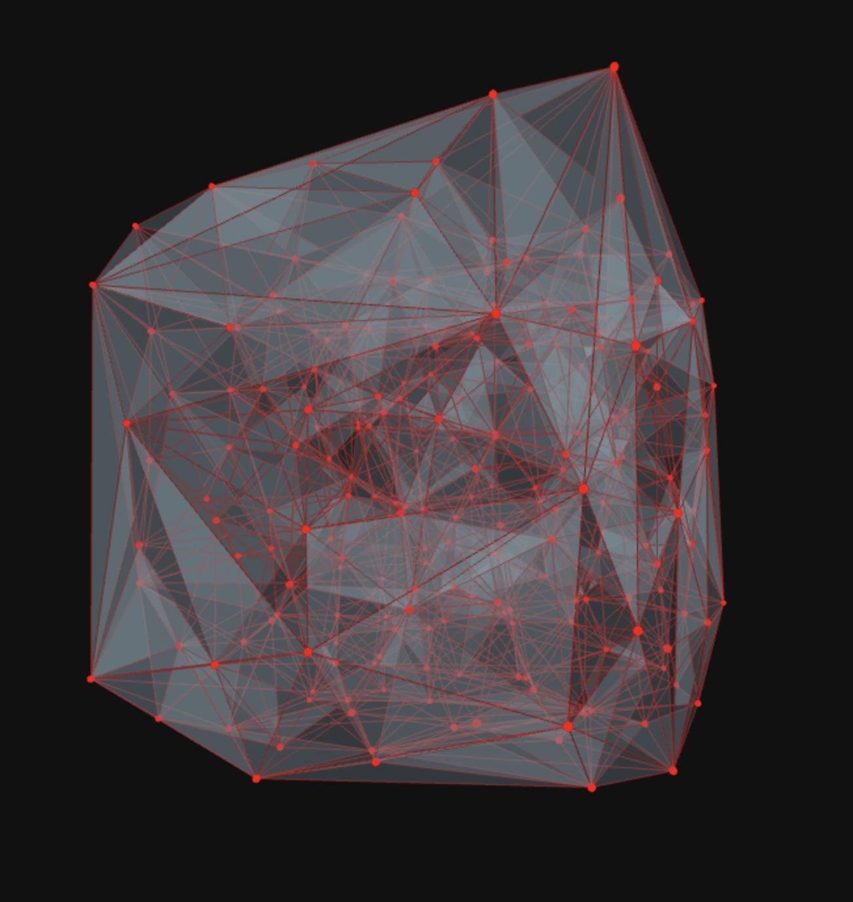
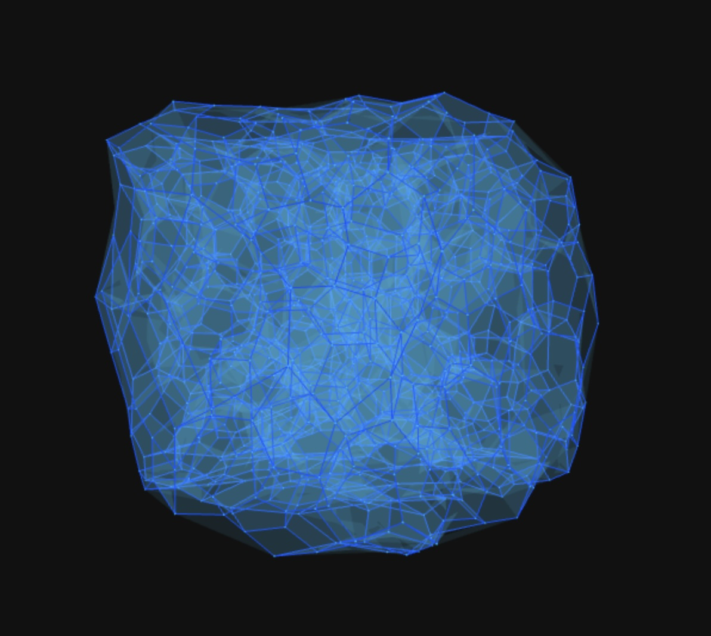
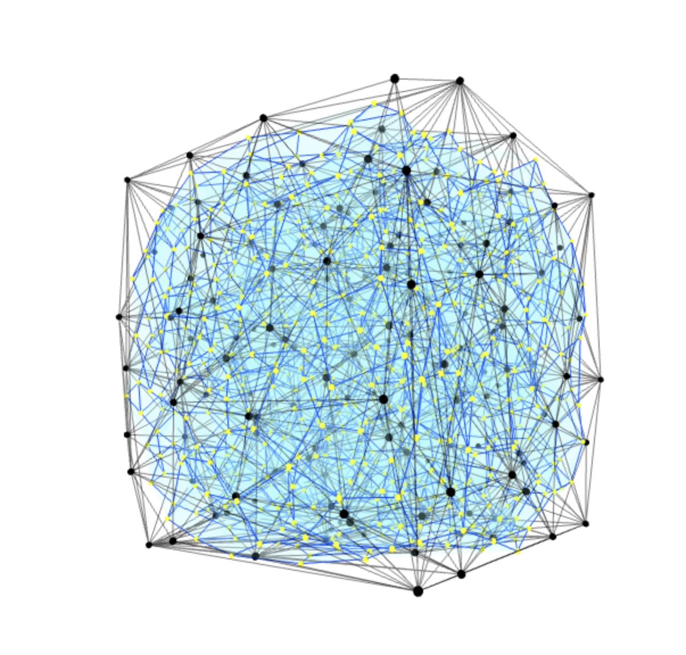

# 3D Delaunay and Voronoi Visualization

This project provides an interactive, real-time 3D visualization of Delaunay tetrahedralization and Voronoi diagrams, built with **Three.js**. It allows users to generate a set of 3D points and see the resulting geometric structures.


*Delaunay tetrahedralization of the point set.*


*The corresponding Voronoi diagram, showing the cellular structure.*


*A combined view showing points, Delaunay edges, and Voronoi cells.*

## Features

- **Interactive 3D View**: Pan, zoom, and rotate the visualization using orbit controls.
- **Real-time Generation**: Generate new point sets and see the Delaunay and Voronoi structures update instantly.
- **Customizable Appearance**: Control the visibility, colors, and sizes of points, edges, and faces through a simple UI.
- **Two Voronoi Modes**:
    - **Barycenter (Fast)**: A fast approximation using the barycenters of the Delaunay tetrahedra.
    - **Circumcenter (Accurate)**: The mathematically correct Voronoi diagram using the circumcenters of the tetrahedra.

## How to Run

1.  Navigate to the example directory:
    ```sh
    cd voronoi-3d-js/examples/threejs_visualization
    ```
2.  Install dependencies:
    ```sh
    npm install
    ```
3.  Start the development server:
    ```sh
    npm run dev
    ```
4.  Open the URL provided by Vite in your browser.

## Libraries Used

- **Three.js**: For 3D rendering and interaction.
- **@derschmale/tympanum**: For robust 3D Delaunay tetrahedralization.
- **Vite**: For the development environment.

## 🎮 **[Interactive Demo](https://virtualorganics.github.io/voronoi-3d-js/demo/)**

Experience the library in action with our **interactive Three.js demo**:
- **🎛️ Comprehensive Control Panel**: Adjust points, colors, sizes, and visibility
- **🔄 Dual Visualization Modes**: Switch between Barycenter and Circumcenter computation
- **📊 Real-time Statistics**: Live mesh data and performance metrics
- **🎨 Full Customization**: Colors, sizes, background, and visual elements
- **⚡ Up to 1,000 Points**: Test complex 3D structures in real-time

**[→ Launch Interactive Demo](https://virtualorganics.github.io/voronoi-3d-js/demo/)**

## ✨ Features

- 🔺 **3D Delaunay Tetrahedralization**: Computes optimal tetrahedral mesh from point sets
- 🔷 **3D Voronoi Diagrams**: Generates dual polyhedral tessellation
- 🚀 **Framework Agnostic**: Works with any JavaScript framework or vanilla JS
- 🌐 **Universal**: Runs in browsers and Node.js environments
- 📦 **Lightweight**: Minimal dependencies, focused on core computation
- 🎯 **Type Safe**: Comprehensive JSDoc annotations
- 🔗 **Method Chaining**: Fluent API for ease of use

## 🚀 Installation

```bash
npm install voronoi-3d-js
```

*Note: This library is not yet published to NPM. Clone the repository to use it locally.*

## 📚 Usage

### Basic Example

```javascript
import { DelaunayVoronoi } from 'voronoi-3d-js';

// 1. Define your 3D points
const points = [
    [0, 0, 0],
    [1, 0, 0],
    [0, 1, 0],
    [0, 0, 1],
    [1, 1, 1]
];

// 2. Create instance and compute
const dv = new DelaunayVoronoi(points).compute();

// 3. Access the results
console.log("Delaunay Tetrahedra:", dv.tetrahedra);
console.log("Voronoi Vertices:", dv.voronoiVertices);
console.log("Voronoi Edges:", dv.voronoiEdges);
```

### Advanced Usage

```javascript
import { DelaunayVoronoi } from 'voronoi-3d-js';

// Generate random points in a cube
const points = Array.from({ length: 50 }, () => [
    Math.random() * 10 - 5,
    Math.random() * 10 - 5,
    Math.random() * 10 - 5
]);

const dv = new DelaunayVoronoi(points).compute();

// Get comprehensive statistics
const stats = dv.getStats();
console.log(`Processed ${stats.pointCount} points`);
console.log(`Generated ${stats.tetrahedraCount} tetrahedra`);
console.log(`Created ${stats.voronoiVertexCount} Voronoi vertices`);
console.log(`Found ${stats.voronoiEdgeCount} Voronoi edges`);

// Get Delaunay edges for visualization
const delaunayEdges = dv.getDelaunayEdges();
console.log(`${delaunayEdges.size} unique Delaunay edges`);
```

## 📖 API Reference

### `DelaunayVoronoi`

Main class for 3D Delaunay/Voronoi computation.

#### Constructor

```javascript
new DelaunayVoronoi(points)
```

**Parameters:**
- `points` (Array): Array of 3D points in format `[[x,y,z], [x,y,z], ...]`

#### Methods

##### `.compute()`

Computes the complete Delaunay tetrahedralization and Voronoi diagram.

**Returns:** `DelaunayVoronoi` (for method chaining)

##### `.getStats()`

Returns comprehensive statistics about the computed structures.

**Returns:** `Object`
```javascript
{
    pointCount: number,
    tetrahedraCount: number,
    voronoiVertexCount: number,
    voronoiEdgeCount: number,
    faceCount: number,
    hasComputed: boolean
}
```

##### `.getDelaunayEdges()`

Extracts unique edges from the Delaunay tetrahedralization.

**Returns:** `Set<string>` - Edge keys in format "i-j"

#### Properties

- `points` (Array): Original input points
- `tetrahedra` (Array): Array of tetrahedra as 4-point index arrays
- `voronoiVertices` (Array): Array of Voronoi vertices as `[x,y,z]` coordinates
- `voronoiEdges` (Array): Array of Voronoi edges as pairs of coordinates
- `adjacency` (Map): Face-to-tetrahedra adjacency mapping

## 🔬 Mathematical Background

### Delaunay Tetrahedralization

A Delaunay tetrahedralization of a set of points in 3D space is a triangulation such that no point lies inside the circumsphere of any tetrahedron. This maximizes the minimum angle of all tetrahedra.

### Voronoi Diagram

The Voronoi diagram is the geometric dual of the Delaunay tetrahedralization. Each Voronoi cell contains all points closer to its generating point than to any other.

### Duality Relationships

- **Delaunay Vertex ↔ Voronoi Cell**
- **Delaunay Edge ↔ Voronoi Face**  
- **Delaunay Face ↔ Voronoi Edge**
- **Delaunay Tetrahedron ↔ Voronoi Vertex**

## 🎨 Visualization Examples

This library is framework-agnostic, but here are examples with popular visualization libraries:

### Three.js Example

```javascript
import * as THREE from 'three';
import { DelaunayVoronoi } from 'voronoi-3d-js';

const points = /* your points */;
const dv = new DelaunayVoronoi(points).compute();

// Visualize Delaunay edges
const delaunayLines = [];
for (const edgeKey of dv.getDelaunayEdges()) {
    const [i, j] = edgeKey.split('-').map(Number);
    delaunayLines.push(
        new THREE.Vector3(...dv.points[i]),
        new THREE.Vector3(...dv.points[j])
    );
}

const delaunayGeometry = new THREE.BufferGeometry().setFromPoints(delaunayLines);
const delaunayMesh = new THREE.LineSegments(delaunayGeometry, material);
```

## 🔧 Development

```bash
# Clone the repository
git clone https://github.com/yourusername/voronoi-3d-js.git
cd voronoi-3d-js

# Install dependencies
npm install

# Run examples
cd examples/threejs_visualization
npm install
npm run dev
```

## 🤝 Contributing

Contributions are welcome! Please feel free to submit a Pull Request.

## 📄 License

MIT License - see the [LICENSE](LICENSE) file for details.

## 🙏 Acknowledgments

- Built with [Tympanum](https://github.com/DerSchmale/tympanum) for robust 3D Delaunay computation
- Inspired by [Delaunator](https://github.com/mapbox/delaunator) for 2D triangulation
- Mathematical foundations from computational geometry research

## 📚 References

- [Delaunay Triangulation - Wikipedia](https://en.wikipedia.org/wiki/Delaunay_triangulation)
- [Voronoi Diagram - Wikipedia](https://en.wikipedia.org/wiki/Voronoi_diagram)
- [Computational Geometry: Algorithms and Applications](https://www.springer.com/gp/book/9783540779735) 